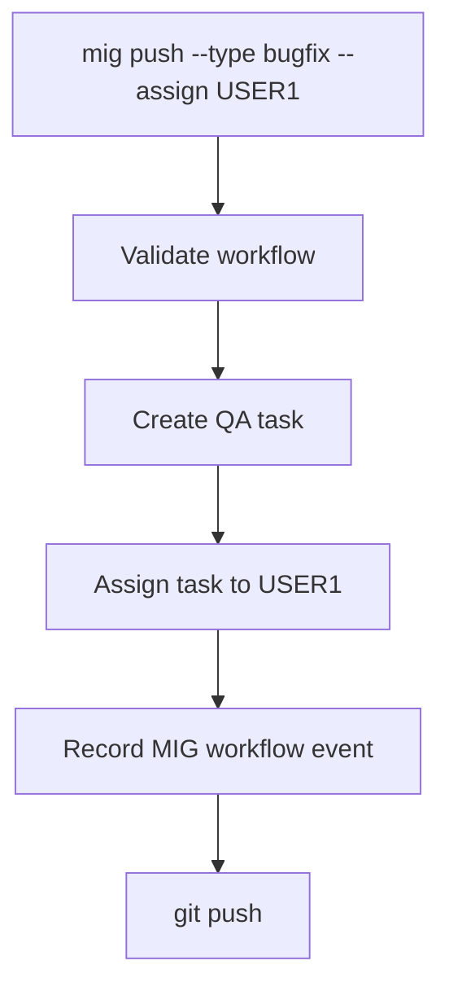
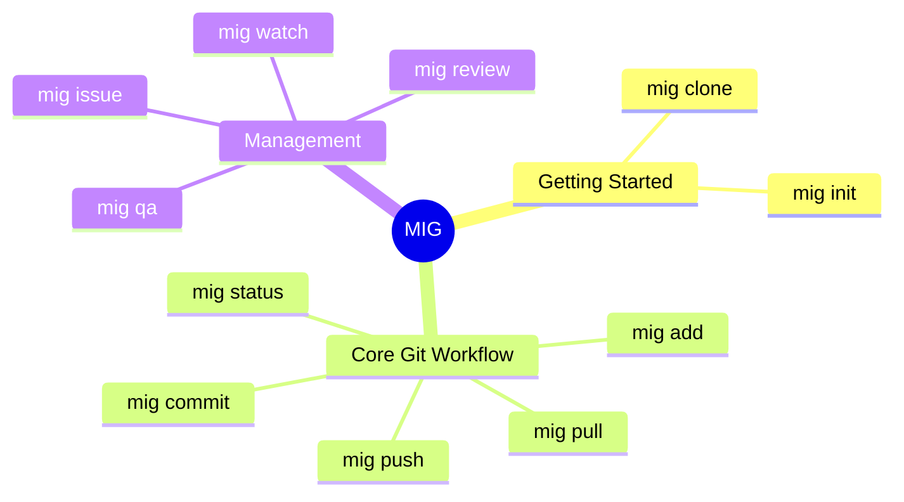

# MIG - Management Integrated Git

MIG is a lightweight development workflow tool that integrates **Git operations** with **project management**, **issue tracking**, **code review**, and **quality assurance (QA)**.

Instead of requiring developers to switch between Git and a separate project-management platform such as Jira, MIG integrates workflow-management actions directly into familiar Git-style commands.

For example:

```shell id="qipjn1"
mig push --type bugfix --assign USER1
```

may execute a MIG workflow that:

1. Verifies that the current branch is valid for a `bugfix` workflow.
2. Creates a bug-fix QA task.
3. Assigns the QA task to `USER1`.
4. Associates the QA task with the current commit and development branch.
5. Records the resulting workflow event in MIG's distributed project metadata.
6. Pushes the source branch after all required pre-push operations complete successfully.

Conceptually:



If any required pre-push operation fails, MIG aborts the workflow before the source branch is pushed.

MIG uses Git-backed project metadata so that workflow information remains distributed alongside the repository rather than depending entirely on a centralized project-management database.

This allows developers to retain Git's distributed development model while incorporating task assignment, workflow state, QA, and code-review information directly into the repository's development process.

## Core Concept

MIG provides a Git-style command-line interface that combines standard Git operations with development workflow management.

Some core commands include:



Standard Git-related commands preserve familiar Git behavior where possible, while MIG-specific commands and options provide project-management functionality such as issue tracking, QA assignment, code review, and workflow-state management.

